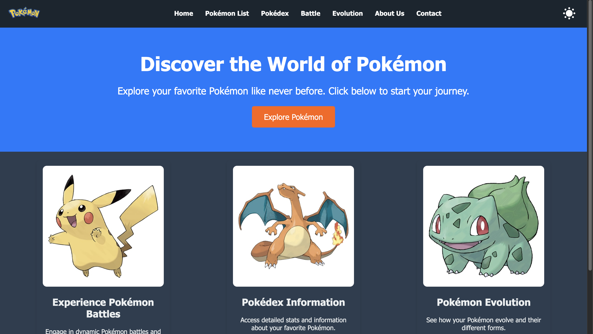
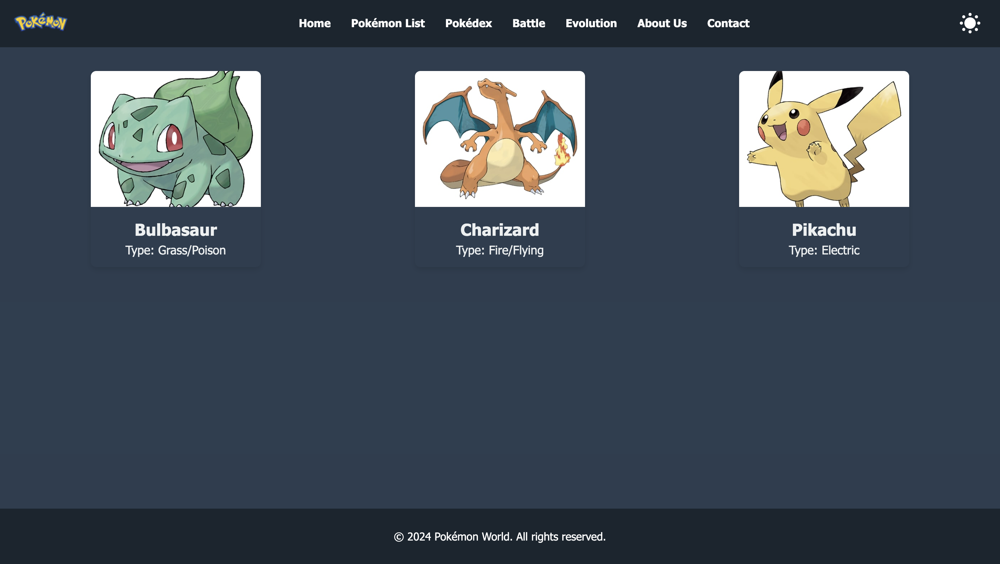
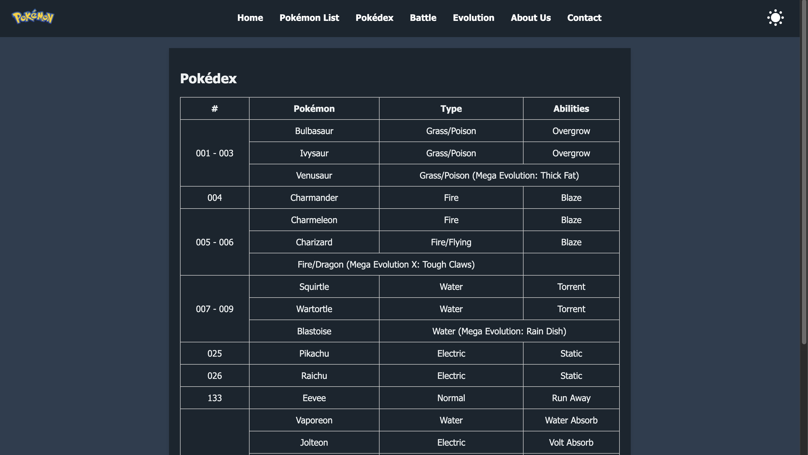
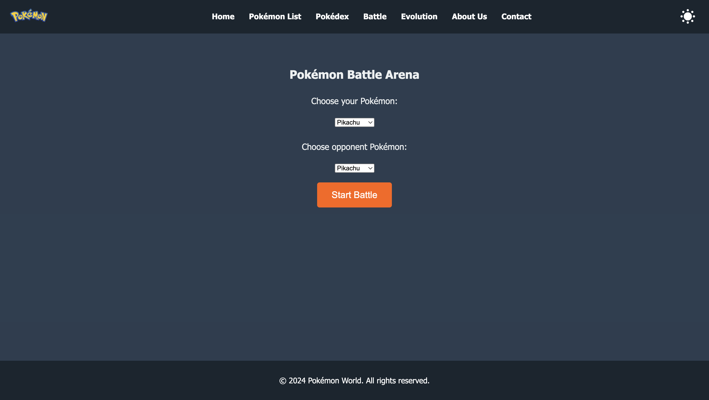
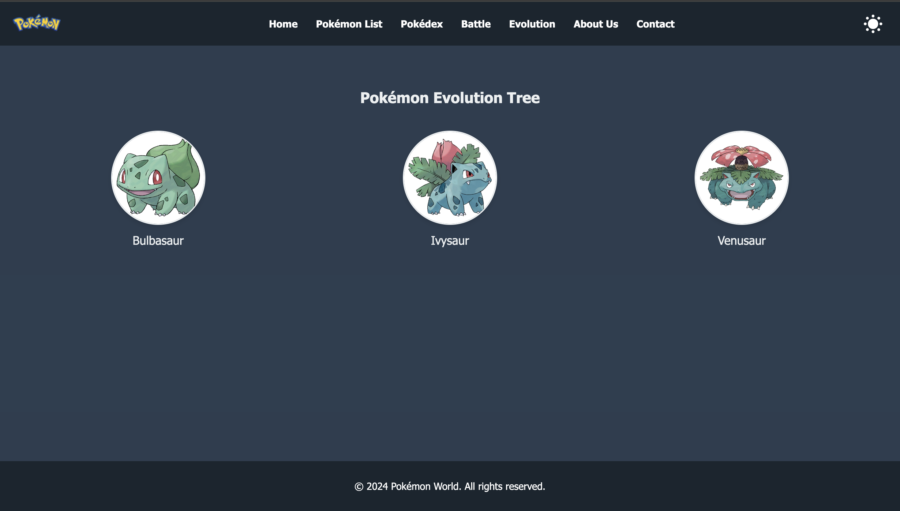
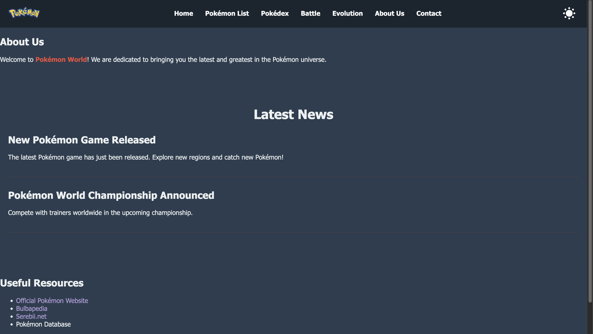
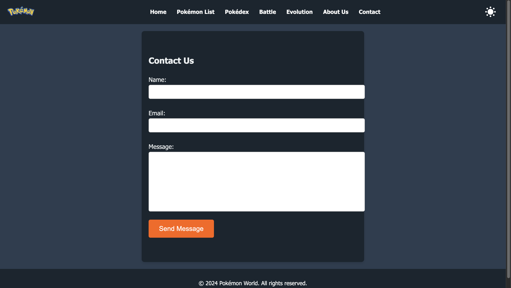

# Pokémon World

Welcome to **Pokémon World**, your ultimate destination for everything related to Pokémon! Whether you're a seasoned trainer or just starting your journey, our website offers a comprehensive range of features to enhance your Pokémon experience. Explore detailed information, engage in battles, learn about evolutions, and stay updated with the latest news in the Pokémon universe.

## 📄 Table of Contents

- [Website Description](#website-description)
- [Pages Overview](#pages-overview)
  - [1. Home](#1-home)
  - [2. Pokémon List](#2-pokémon-list)
  - [3. Pokédex](#3-pokédex)
  - [4. Battle](#4-battle)
  - [5. Evolution](#5-evolution)
  - [6. About Us](#6-about-us)
  - [7. Contact](#7-contact)
- [HTML Elements Used](#html-elements-used)
- [CSS Styling](#css-styling)
- [JavaScript Interactivity](#javascript-interactivity)
- [Validation](#validation)
  - [HTML Validation](#html-validation)
  - [CSS Validation](#css-validation)
- [Screenshots](#screenshots)
- [Technologies Used](#technologies-used)
- [Contact Information](#contact-information)

## Website Description

**Pokémon World** is a hand-coded website designed to provide enthusiasts with a rich and interactive platform to explore various aspects of Pokémon. From detailed Pokédex entries and evolution trees to engaging battle arenas and up-to-date news, Pokémon World aims to be your go-to resource for all things Pokémon. The website features a clean, responsive design with both light and dark modes to ensure a pleasant user experience across all devices.

## Pages Overview

### 1. Home

**URL:** `index.html`

**Description:**
The Home page serves as the landing page for Pokémon World. It features a captivating hero section with a background image and a call-to-action button encouraging users to explore the Pokémon list. Additionally, the Home page showcases key features such as Pokémon Battles, Pokédex Information, and Pokémon Evolution through visually appealing sections with images and descriptive text.

**Key Elements:**
- Hero Section with background image and text overlay
- Features Section with articles and images
- Navigation Bar with dark mode toggle

### 2. Pokémon List

**URL:** `pokemon-list.html`

**Description:**
The Pokémon List page presents a gallery of various Pokémon, each displayed in a card format with an image, name, and type. This page allows users to browse through different Pokémon and serves as a gateway to more detailed information available in the Pokédex.

**Key Elements:**
- Pokémon Gallery with cards
- Images with `alt` attributes for accessibility
- Consistent navigation and styling

### 3. Pokédex

**URL:** `pokedex.html`

**Description:**
The Pokédex page provides a structured table containing essential information about selected Pokémon, including their Pokédex number, name, type, and abilities. This organized format allows users to quickly reference and compare different Pokémon attributes.

**Key Elements:**
- Semantic `<table>` with `<thead>` and `<tbody>`
- Table headers and data cells
- Responsive design for readability

### 4. Battle

**URL:** `battle.html`

**Description:**
The Battle page offers an interactive Pokémon Battle Arena where users can select their Pokémon and an opponent to engage in a simulated battle. The outcome is determined based on predefined matchups, providing an engaging and fun experience for users.

**Key Elements:**
- Pokémon selection dropdowns
- Battle button with event listener
- Battle result display

### 5. Evolution

**URL:** `evolution.html`

**Description:**
The Evolution page showcases the evolution trees of various Pokémon. Users can visualize the stages of evolution through images and captions, helping them understand how different Pokémon evolve over time.

**Key Elements:**
- Evolution Tree with `<figure>` and `<figcaption>`
- Images representing different evolution stages
- Responsive layout for clarity

### 6. About Us

**URL:** `about.html`

**Description:**
The About Us page provides information about Pokémon World, its mission, and the team behind it. It also includes the latest news and a list of useful resources for Pokémon enthusiasts.

**Key Elements:**
- About section with headers and paragraphs
- News articles with `<article>` elements
- Resources list with unordered lists

### 7. Contact

**URL:** `contact.html`

**Description:**
The Contact page features a contact form where users can submit their name, email, and messages. This form allows users to reach out with inquiries, feedback, or support requests.

**Key Elements:**
- Contact Form with `<form>`, `<input>`, and `<textarea>`
- Form validation and submission handling
- User feedback messages

## HTML Elements Used

To ensure semantic structure and enhance accessibility, the website utilizes a variety of HTML5 elements:

- **Semantic Elements:**
  - `<header>`: Encapsulates the top section of each page, including the navigation bar.
  - `<nav>`: Contains the navigation links to different pages.
  - `<main>`: Represents the main content area of each page.
  - `<section>`: Divides content into distinct sections, such as About Us, News, Resources, etc.
  - `<article>`: Wraps individual news items or blog posts.
  - `<figure>` and `<figcaption>`: Groups images with their captions in the Evolution page.
  - `<footer>`: Contains the footer content present on all pages.
  
- **Non-Semantic Elements:**
  - `
`: Used as a container for layout and styling purposes.
  - ``: Used for inline styling, such as highlighting text.

- **Form Elements:**
  - `<form>`, `<label>`, `<input>`, `<textarea>`, `<button>`: Used in the Contact page for user input.

- **Table Elements:**
  - `<table>`, `<thead>`, `<tbody>`, `<tr>`, `<th>`, `<td>`: Used in the Pokédex page to display Pokémon data.

## Advanced HTML Features
- **rowspan and colspan in Tables:** The Pokédex table uses `rowspan` to group Pokémon with similar attributes (e.g., evolutions or shared abilities) and `colspan` to merge cells for Pokémon with additional information like Mega Evolutions.
- **Nested Lists:** In the Resources section, nested lists are used to categorize resources into "Official Resources," "Community Resources," and "Database Resources," enhancing the content structure and readability.

## CSS Styling

The website's visual design is managed through a dedicated `styles.css` file, which ensures a consistent and aesthetically pleasing appearance across all pages. Key styling features include:

- **CSS Variables:** Defined in the `:root` selector for easy theme management and color consistency.
- **Light and Dark Modes:** Implemented using CSS classes to switch between themes, enhancing user experience.
- **Responsive Design:** Utilizes Flexbox and media queries to ensure the website is accessible on various devices and screen sizes.
- **Typography:** Custom font families, sizes, weights, and colors to improve readability and visual hierarchy.
- **Layout Adjustments:** Flexbox is used extensively for navigation, feature sections, and galleries to manage the positioning and spacing of elements.
- **Interactive Elements:** Hover effects, transitions, and transformations enhance user interactivity and engagement.
- **Box Model Utilization:** Proper use of padding, margins, borders, and box-shadows to create visually appealing containers and components.
- **Hyperlink Styling:** Custom styles for links, including pseudo-classes like `:hover`, `:active`, and `:visited` to provide visual feedback to users.

## JavaScript Interactivity

The `script.js` file adds dynamic functionality to Pokémon World, enhancing user engagement through interactive features:

1. **Theme Toggle Functionality:**
   - **Purpose:** Allows users to switch between light and dark modes.
   - **Implementation:**
     - Detects and applies the user's saved theme preference using `localStorage`.
     - Toggles the `dark-mode` class on the `<body>` element when the theme toggle button is clicked.
     - Saves the user's theme preference to `localStorage` for persistence across sessions.

2. **Pokémon Battle Mechanism:**
   - **Purpose:** Simulates a battle between two selected Pokémon and displays the winner.
   - **Implementation:**
     - Listens for a click event on the "Start Battle" button.
     - Retrieves the selected Pokémon from dropdown menus.
     - Determines the winner based on predefined matchups.
     - Displays the battle result dynamically on the page.

3. **Contact Form Validation:**
   - **Purpose:** Validates user input in the contact form and provides feedback.
   - **Implementation:**
     - Listens for the form's submit event.
     - Prevents default form submission behavior.
     - Checks if all required fields are filled.
     - Displays a success message if inputs are valid or an error message if any field is missing.

**Note:** All JavaScript functions are executed without errors (also ensured from console in the browser), ensuring a smooth and responsive user experience.

## Validation

### HTML Validation

All HTML pages have been validated using the [W3C Markup Validation Service](https://validator.w3.org/). The validation ensures that the HTML syntax is correct and adheres to web standards, promoting better compatibility and accessibility.

**Front Page Validation Link:**
[Validate Home Page HTML](https://validator.w3.org/nu/?doc=https://assignment1sairohithnwdt.glitch.me/index.html)

### CSS Validation

The `styles.css` file has been validated using the [W3C CSS Validation Service](https://jigsaw.w3.org/css-validator/). This validation checks for any syntax errors or compatibility issues within the CSS, ensuring that styles are applied consistently across different browsers.

**Front Page CSS Validation Link:**
[Validate CSS](https://jigsaw.w3.org/css-validator/validator?uri=https://assignment1sairohithnwdt.glitch.me/styles.css&profile=css3&usermedium=all&warning=1&vextwarning=&lang=en)

## Screenshots

*Include screenshots of each page to provide a visual overview of your website. This section is optional but highly recommended to showcase your work.*

*Home Page featuring the hero section and feature highlights.*

*Pokémon List displaying a gallery of Pokémon cards.*

*Pokédex table with detailed Pokémon information.*

*Battle Arena where users can engage in Pokémon battles.*

*Evolution Tree showcasing different stages of Pokémon evolution.*

*About Us page with latest news and resources.*

*Contact Form for user inquiries and feedback.*

## Technologies Used

- **HTML5:** For structuring the content with semantic elements.
- **CSS3:** For styling, layout, and responsive design.
- **JavaScript:** For adding interactivity and dynamic functionalities.
- **W3C Validators:** For ensuring code quality and adherence to web standards.

## Resources and References

- **Dark Mode Toggle Button Design:** The design inspiration for the dark mode toggle button was taken from [toggles.dev](https://toggles.dev/expand). The implementation was customized to fit the project requirements using only vanilla HTML, CSS, and JavaScript.
- **HTML & CSS Validation:** The code has been validated using the W3C HTML and CSS Validation Services.
  - [HTML Validation Report]([https://validator.w3.org/](https://validator.w3.org/nu/?doc=https://assignment1sairohithnwdt.glitch.me/index.html)).
  - [CSS Validation Report]([https://jigsaw.w3.org/css-validator/](https://jigsaw.w3.org/css-validator/validator?uri=https://assignment1sairohithnwdt.glitch.me/styles.css&profile=css3&usermedium=all&warning=1&vextwarning=&lang=en).
- **Additional Resources:**
  - JavaScript tutorials and guides from MDN Web Docs.
  - CSS layout and design techniques from CSS Tricks.

## Code Comments

The code includes detailed comments to explain the purpose and functionality of each section. This helps in understanding the logic behind the theme toggle, battle mechanism, form validation, and modal popup features. The comments provide context for future developers or anyone reviewing the code.

---

**Pokémon World** is a passionate project aimed at bringing Pokémon enthusiasts closer to the creatures they love. We hope you enjoy exploring our website and discovering all the features we've crafted to enhance your Pokémon journey!

